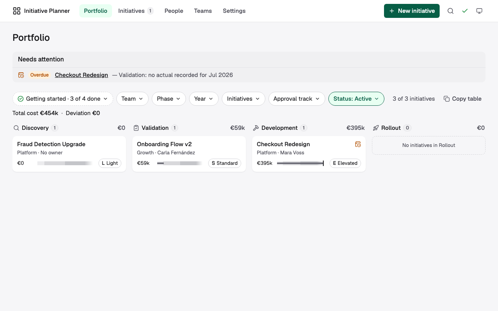
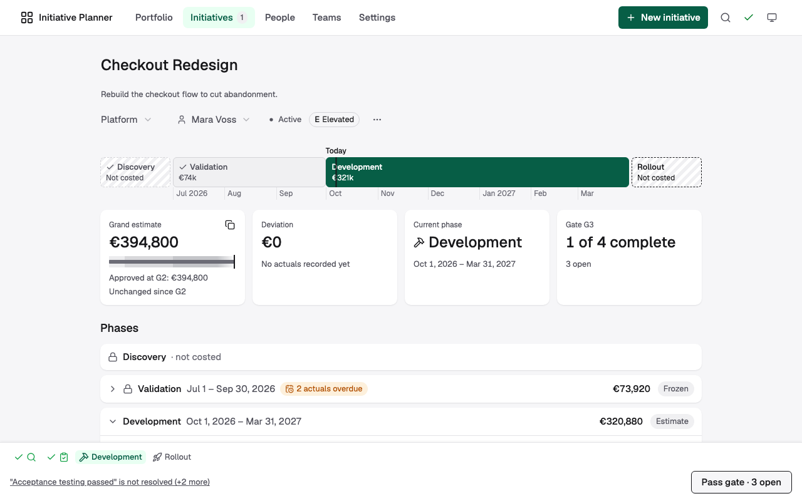
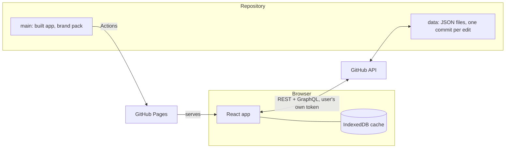

<div align="center">

# Initiative Planner

**Plan what an initiative costs and who has time for it. Your GitHub repository is the backend.**

[](https://github.com/jabopiti/initiative-planner/actions/workflows/ci.yml)
[](./LICENSE)
[](https://jabopiti.github.io/initiative-planner/)

[Live app](https://jabopiti.github.io/initiative-planner/) · [Why I built it](#why-i-built-this) · [How it works](#how-it-works) · [Host your own](#host-your-own) · [Specification](./docs/spec.md)

<picture>
  <source media="(prefers-color-scheme: dark)" srcset="./docs/images/portfolio-dark.png">
  
</picture>

</div>

## Why I built this

On project after project I ran into the same gap. Someone asks what an initiative will cost, who is committed to it, and what it was approved at. The answer is a spreadsheet. Usually several: every manager keeps their own, each laid out a little differently. Rates get copied in by hand, the capacity sheet disagrees with the cost sheet, and a gate review starts with a hunt for the latest version.

The tools that are supposed to fix this don't. Jira and its relatives track work, not cost per month or a person's share of their time. Portfolio suites that do track both come with licences, admins and a rollout of their own. For a small initiative that is more process than the problem. So the spreadsheets stay.

I started with a small HTML file, just for me. One file, no server, data in the browser. Cost fell out of who does what, for how long, at what percentage. It was enough for me on every project I took it to.

Then other people wanted it, and a file on one laptop doesn't work for a team. Most teams have no spare backend to host it on. Most of the ones I worked with had GitHub.

That set the challenge: **host the app on GitHub Pages and keep the data in the repository itself**, with several people editing at once and no server in between. Pages is easy. Using a git repository as a multi-user database is the hard part, and most of this codebase is about getting that right.

The first spike went wrong in a useful way. A test write to the Contents API without a `branch` parameter landed on `main`, because GitHub defaults to the default branch. I reverted it in public and wrote the lesson into the spec: every write names its branch, and a test enforces it. Later spikes found that a stale write comes back as a clean 409 you can merge from, and that GraphQL can read a hundred files in one request. That cut a cold load from 209 requests to 5.

I wrote the specification first, cut it into a backlog of thin slices, and built each slice with [Claude Code](https://claude.com/claude-code) against tests. [`docs/spec.md`](./docs/spec.md) is the authority; the code follows it.

## What it does


<picture>
  <source media="(prefers-color-scheme: dark)" srcset="./docs/images/initiative-dark.png">
  
</picture>

- One process for everyone. Every initiative moves through the same phases and gates. Passing a gate freezes what it was approved at, so "what did we sign off?" always has an answer.
- Cost follows from the plan. People cost comes from who is allocated, for how long, at what share of full time, at their country's rate. Everything else is a named cost item. Actuals sit next to estimates, and the deviation is shown.
- Capacity per team. A person can sit in several teams, and each team draws only on the share it holds.
- Gates without surprises. Open checklist items and missing actuals show up in a Needs attention strip while you work.
- Approval tracks. The grand estimate maps to a budget band, and the tool flags an initiative that crosses into a higher one.
- White label. Process, branding and example data live in one brand pack. A build fails on bad colours, overlapping bands or an incomplete process.
- Offline reading. When GitHub is unreachable, the last synced data stays readable and writes pause until sync is back.

## How it works



There is no server. The app comes from GitHub Pages, and each user signs in with their own fine-grained token, which stays in their browser. Every edit is a commit on a separate `data` branch, under the name of the person who made it, so the commit history is the audit trail and data changes never trigger a deploy.

### The hard part: a database without a server

| Problem | What the app does |
|---|---|
| Two people edit at once | Pushes against the last version it holds. If the repository answers that the file changed, it pulls and merges at field level, so edits to different fields both survive. Two edits to the same field show up inline. |
| Staying current | Pulls on load, when the tab regains focus and every 5 minutes. Conditional requests make an unchanged branch nearly free. |
| GitHub is down, rate-limited or the token is refused | Switches to read-only with the cause named, retries by itself and replays the failed edits on recovery. |
| Changes spanning many files | One commit through the Git data API or GraphQL, never half-applied. |
| Rate limits | Changed files are read about a hundred per GraphQL query, and a request budget is shown in Settings → Connection. |
| No custom headers on Pages | A strict content security policy as a `<meta>` tag, checked by an end-to-end test against the production build. |

The sync design is in [spec §3](./docs/spec.md) and §10. The experiments that shaped it are in [`docs/history/spike-findings.md`](./docs/history/spike-findings.md).

## Host your own

Each deployment is its own copy of this repository. You change only the brand pack; core code stays untouched, so you can pull in updates later.

1. **Create your copy.** Your planning data will live on its `data` branch, so keep the copy private. A fork of a public repository is always public, so clone this repository and push it to a new private repository instead. GitHub Pages works from private repositories on GitHub Pro, Team and Enterprise plans, not on Free. If your data may be public, a plain fork is fine and takes updates through GitHub's fork sync.
2. **Enable Pages** in the repository's settings with *GitHub Actions* as the source. Pushes to `main` build and deploy through [`deploy.yml`](./.github/workflows/deploy.yml). The build fails if the brand pack is invalid.
3. **Create a fine-grained token** for the repository with *Contents: Read and write*. The Connect screen walks you through it ([spec §5.10](./docs/spec.md)).
4. **Invite your team** with write access to the repository. Everyone with write access is a full participant.

> [!IMPORTANT]
> Serve the app from its own domain, for example a custom domain in the Pages settings. Browser storage is shared across a whole `<account>.github.io` origin, so there the app turns off "Remember me".

The brand pack is currently one file, [`src/brand/defaultBrand.ts`](./src/brand/defaultBrand.ts); splitting it into a per-fork folder is planned. The full model is in [spec §2 and §10.7](./docs/spec.md).

## Run it locally

You need Node.js 22.22 or newer and a token as above.

```sh
npm install
npm run dev
```

The dev server opens at <http://localhost:5173> and shows the Connect screen. To skip sign-in while developing, put `VITE_DEV_TOKEN=<your token>` in a git-ignored `.env.local`.

| Command | What it does |
|---|---|
| `npm run test:quiet` | Unit and component tests (Vitest) |
| `npm run test:e2e` | Playwright against the production build, with a fake GitHub, the strict CSP and an axe accessibility scan of every screen |
| `npm run typecheck` / `npm run lint` | TypeScript and ESLint, warnings fail |
| `npm run build:quiet && npm run preview` | The production build, served locally |

CI also runs coverage thresholds, `npm audit`, a licence check, secret scanning over the whole history, and a weekly re-run for new vulnerabilities.

## Built with

React 19, TypeScript and Vite. Tailwind CSS v4, with shadcn/ui on Radix primitives owned as source. Lucide icons, date-fns, IndexedDB for the cache. No charting library and no runtime CSS-in-JS: the strict CSP rules out inline scripts and `eval`, and the bundle stays small.

## Status

Live and under active development. All planned slices are delivered. The deployed app is the reference deployment. New work is tracked in [`backlog/slices-overview.md`](./backlog/slices-overview.md).

## Documentation

| Doc | What it covers |
|---|---|
| [`docs/spec.md`](./docs/spec.md) | The product, UI and technical specification |
| [`backlog/slices-overview.md`](./backlog/slices-overview.md) | The open backlog; delivered slices are archived in `backlog/done/` |
| [`backlog/example-data.md`](./backlog/example-data.md) | Seed data (process, roles, countries, branding) |
| [`docs/history/`](./docs/history) | The prototype, its engine audit and the GitHub spike findings |
| [`docs/ux-review-2026-10.md`](./docs/ux-review-2026-10.md) | The October 2026 UX review |
| [`AGENTS.md`](./AGENTS.md) | Instructions for AI coding agents working in this repo |
| [`SECURITY.md`](./SECURITY.md) | How to report a vulnerability |

## Licence

[PolyForm Internal Use 1.0.0](./LICENSE). You may use and modify the software for the internal business operations of you and your company. You may not distribute it. A private copy run for your own organisation's planning is the intended use. For anything else, ask the author, [@jabopiti](https://github.com/jabopiti).
