# Initiative Planner UX review (October 2026)

Interactive version: https://claude.ai/artifact/N1ACd6uWpcDXFLUTz8QW74 (private). Reviewed 2 Oct 2026 on build `a083d76`. 31 findings: 0 P0, 10 P1, 16 P2, 5 P3.

I clicked through every screen in §5 at 1440px and 1280px, ran the main flows end to end, used the keyboard, ran axe, and looked at every state I could trigger. The app's behaviour is sound and closely follows the spec. Most problems are about layout and visual consistency: clipped fields, unlabelled icons, a detail page that uses half the window, and no theme control. No P0 issues were found.

## How it was checked

- **Driving the app:** Playwright in Chromium against the dev server. Every finding links to its screenshot.
- **Data:** the brand pack's example data, loaded through Settings → Danger zone, plus flows that created, gated, held and deleted initiatives.
- **Criteria:** spec conformance (§5, §9), Nielsen's heuristics, IA and navigation, visual consistency, WCAG 2.2 AA (keyboard, focus, axe, landmarks), copy, feedback states, and the visual design recommendations.
- **Viewports:** 1440×900 and 1280×800. The dark theme was previewed by forcing the `.dark` class (F04).
- **Severity:** P0 blocks a task or fails AA · P1 major friction or spec gap · P2 minor friction or inconsistency · P3 polish. Effort: S / M / L.

> **Changed from the agreed plan:** the browser couldn't reach the real GitHub through this environment's network proxy, so the app ran against the repo's fake GitHub (`e2e/support/fakeGithub.ts`). Screens and flows behave the same. Real sync timing and multi-user conflicts weren't tested, and the offline state was simulated.

## Top 10 to fix first

1. **F05 (P1)**: The current phase isn't where the page opens
2. **F06 (P1)**: The gate count includes a requirement the panel doesn't list
3. **F07 (P1)**: The magic bar doesn't say what its dots mean, and blocked Pass gate looks like plain text
4. **F01 (P1)**: Percent fields cut off three-digit values
5. **F02 (P1)**: Inline errors push the allocation table out of shape
6. **F03 (P1)**: Two focus styles, and the button one is hard to see
7. **F04 (P1)**: No theme switch, so the dark theme can't be reached
8. **F08 (P1)**: Editable header fields don't look editable
9. **F10 (P1)**: Row actions are unlabelled icons with mixed meanings
10. **F11 (P2)**: Half the window is unused on the main working page

## Findings

### F01 · P1 · Percent fields cut off three-digit values

*Initiative detail · Team detail · Person panel · effort S*

- **What happens:** Allocation %, Team FTE % and Capacity fields are too narrow for "100". The field shows "10(" (team members, Felix Brandt's allocation, the person panel). The number spinner arrows take more of the width.
- **Why it matters:** Someone scanning the table reads 100 % as 10 %. The figures that drive every cost need to be readable. §9.11 (inputs and amounts).
- **Recommendation:** Size percent fields for "100" plus the spinner, or drop the spinner. Use one shared PercentInput with a fixed min-width (about 4.5rem) and the % shown as an inline suffix inside the field.

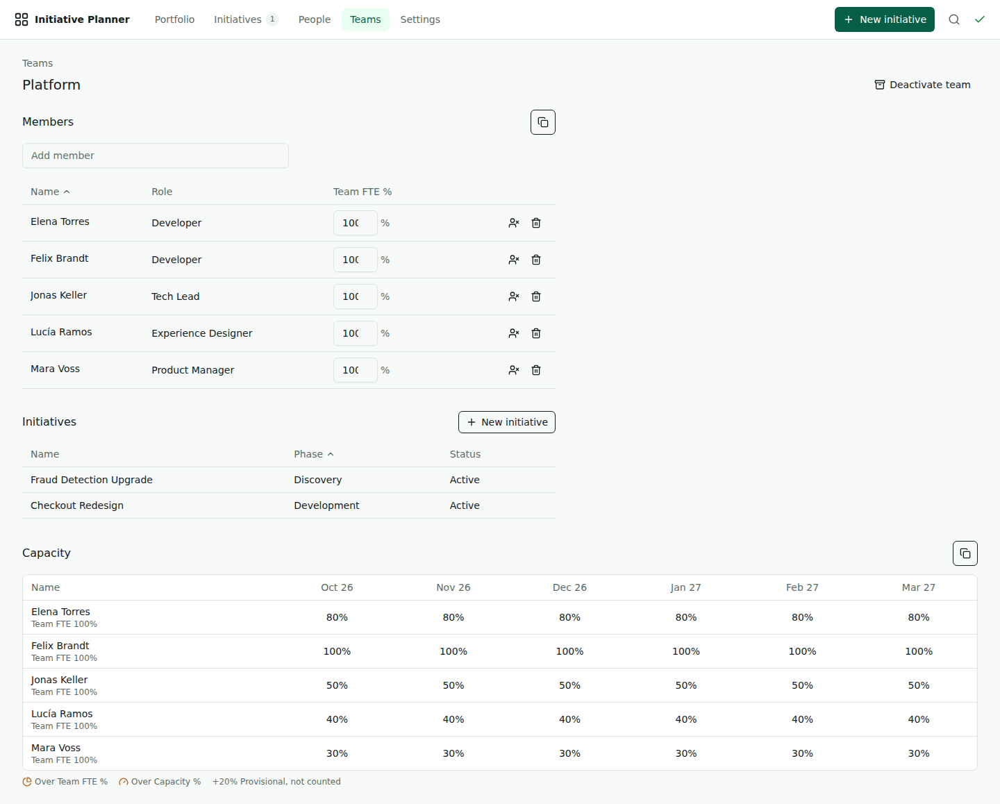 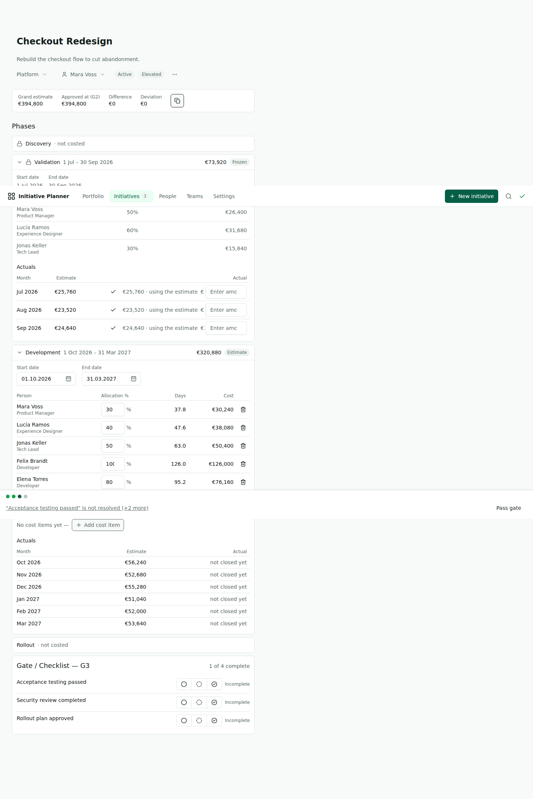 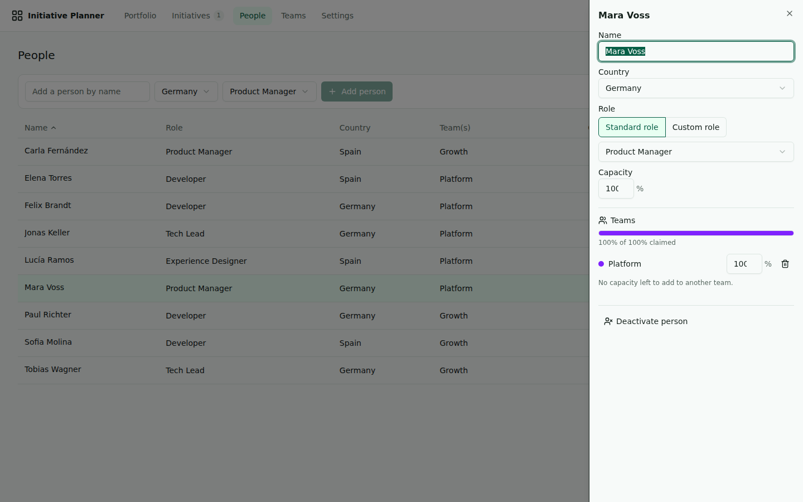

### F02 · P1 · Inline errors push the allocation table out of shape

*Initiative detail · effort S*

- **What happens:** A validation message ("Enter a percentage from 0 to 100.") or a failed save ("Not saved … Retry") is rendered inside the Allocation % cell. The columns re-flow, the Person column shrinks, and names wrap over four lines ("Carla / Fernández / Product / Manager").
- **Why it matters:** The table jumps while the user is typing, and the row with the problem becomes the hardest one to read. Heuristic: consistency and error recovery.
- **Recommendation:** Give the table fixed column widths (table-layout: fixed, or a CSS grid row). Show the message in a full-width row under the affected row, keeping the field, the red border and the icon in place.

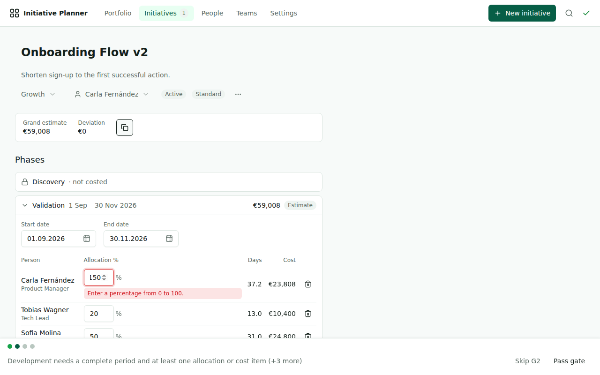 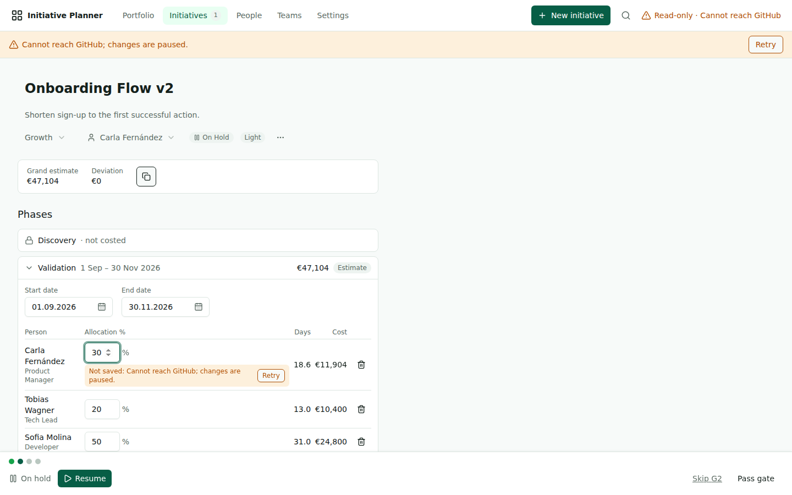

### F03 · P1 · Two focus styles, and the button one is hard to see

*All screens · effort S*

- **What happens:** Links, chips and table headers use the base 2px solid ring with an offset. shadcn buttons, selects and inputs switch that off (outline-none) and use a 3px ring at 50% opacity with no offset. On the primary green button it is green on green. On selects, focus mostly shows as a 1px border colour change.
- **Why it matters:** WCAG 2.4.7 Focus Visible and 1.4.11 Non-text Contrast need an indicator a keyboard user can actually see. §9.5 asks for a visible focus indicator everywhere.
- **Recommendation:** Use one focus token in the button, input and select variants: `focus-visible:outline-2 outline-offset-2 outline-focus-ring` (drop `ring/50`). Add a check to the e2e axe pass, or a Playwright test, for focus visibility on the primary button.

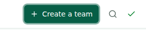 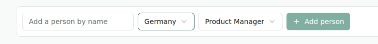

### F04 · P1 · No theme switch, so the dark theme can't be reached

*Whole app · effort M*

- **What happens:** The brand pack defines a full dark palette, but nothing applies the `.dark` class and there is no System / Light / Dark control. No backlog slice covers it. To review the dark tokens I had to add the class by hand.
- **Why it matters:** §9.1 requires one control that cycles System, Light and Dark and is remembered. The dark tokens are also never tested in context. In dark, inline-edit fields suddenly show filled boxes that light mode doesn't have (F08).
- **Recommendation:** Add a slice: a theme control in the top bar (icon button with a tooltip), System by default, stored in localStorage, applied before first paint by the app's own module script (CSP-safe). Run the a11y e2e suite in both themes.

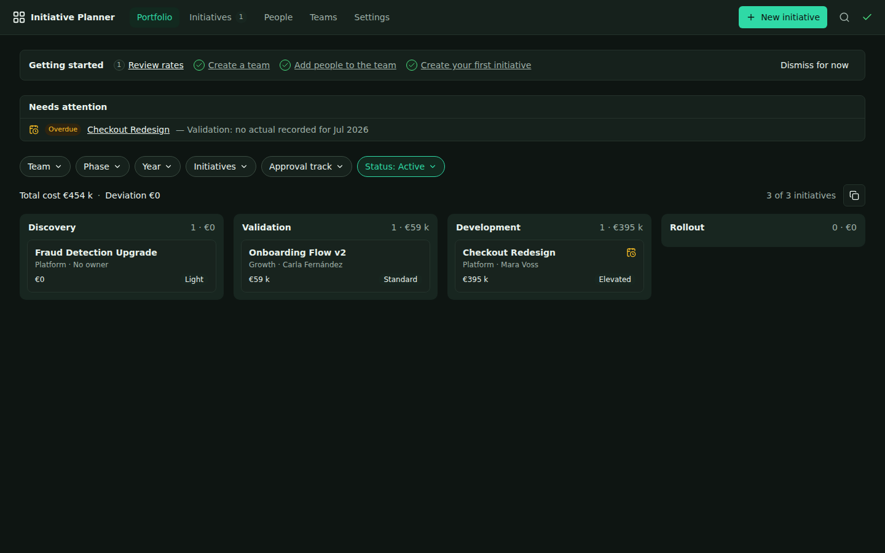 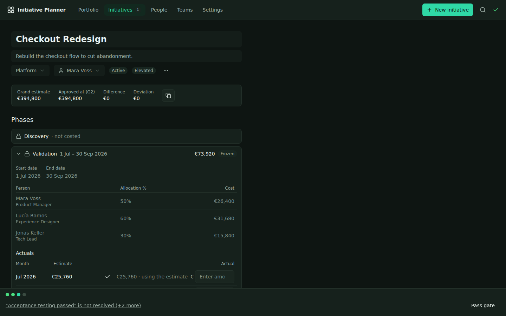

### F05 · P1 · The current phase isn't where the page opens

*Initiative detail · effort S*

- **What happens:** Checkout Redesign is in Development, but the page opens with Validation (a past, frozen phase) expanded and Development collapsed. The Gate / Checklist panel for G3 sits under Rollout, not directly under the current phase.
- **Why it matters:** §5.4: "The current phase is expanded … and the Gate / Checklist panel for the gate leaving it sits directly beneath it." The first thing a user sees should be what they're working on now. Heuristic: match to the user's task.
- **Recommendation:** Always expand the current phase. When an older phase needs attention (overdue actuals), keep it collapsed with a warning chip on its header row. Render the gate panel immediately after the current phase.

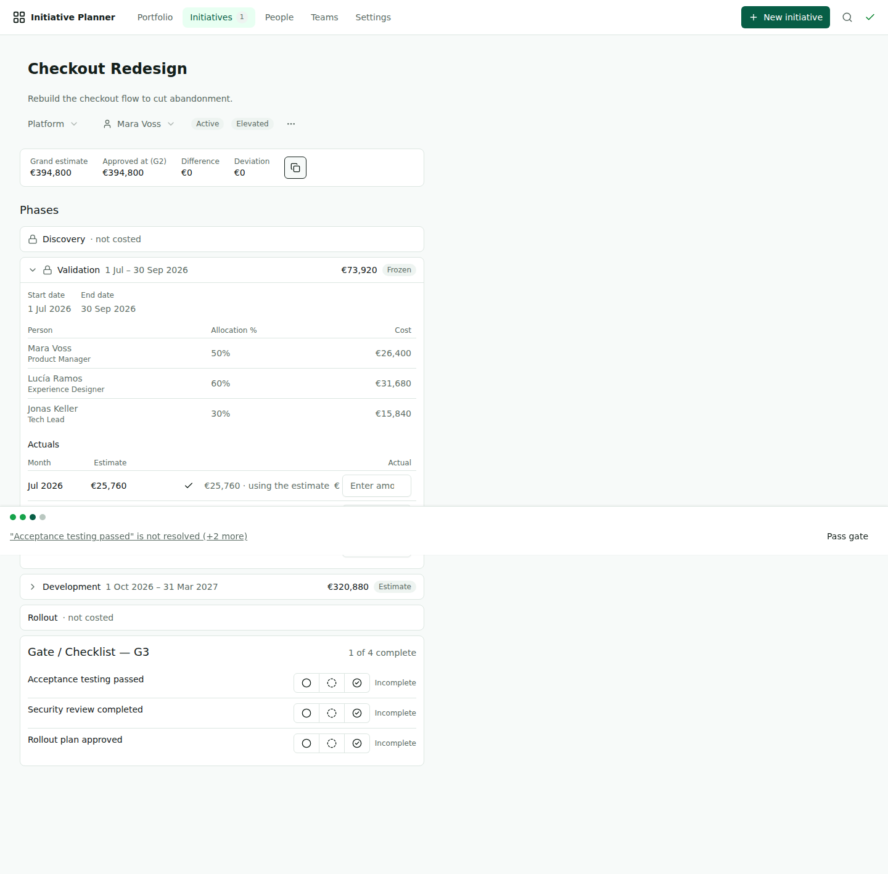 

### F06 · P1 · The gate count includes a requirement the panel doesn't list

*Initiative detail · effort M*

- **What happens:** The panel says "1 of 4 complete" (Checkout) and "0 of 4 complete" (Onboarding) but lists only three checklist items. The fourth requirement (the next phase's plan) only appears in the magic bar's guidance text.
- **Why it matters:** Users can't find the missing item, so the count reads as a bug. §8.1 requirements are read as "X of Y complete", so the panel should list all Y.
- **Recommendation:** List the non-checklist requirements as rows in the panel ("Development has a period and at least one allocation", with a Go to link), above the checklist items. Use the same Met / Open styling.

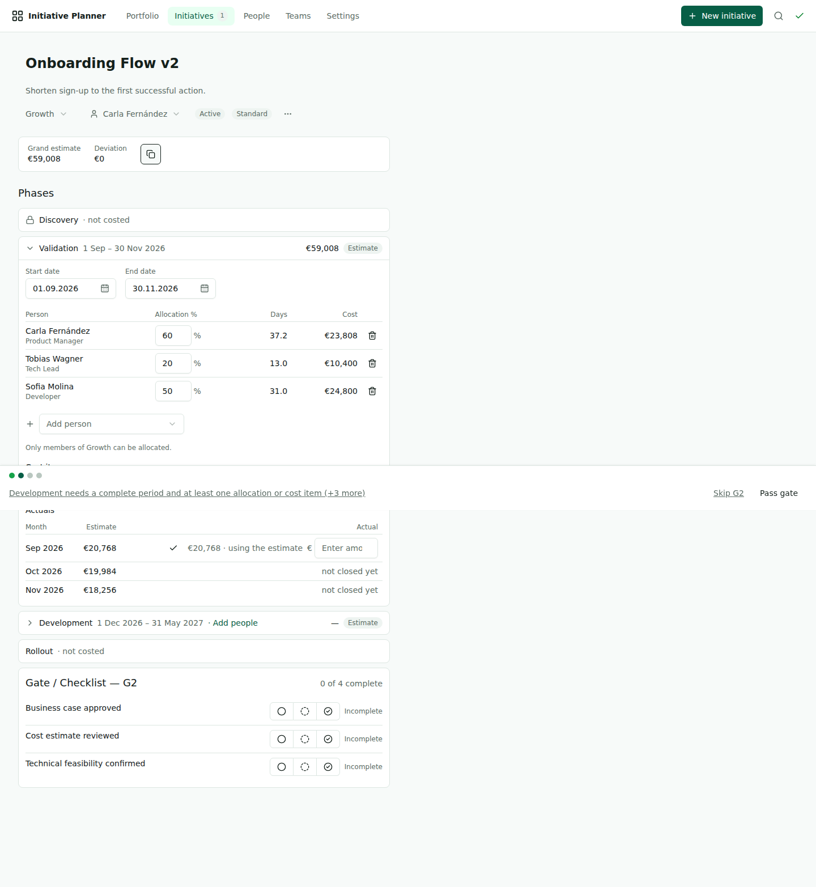 

### F07 · P1 · The magic bar doesn't say what its dots mean, and blocked Pass gate looks like plain text

*Initiative detail · magic bar · effort M*

- **What happens:** The phase overview is four unlabelled 8px dots. While blocked, Pass gate is a ghost button with no border, which reads as plain text. The bar spans the full window while the content is a 656px column, and its left edge (16px) doesn't line up with the page (32px).
- **Why it matters:** §5.4 describes the dots as a stepper showing complete, current and ahead. §9.5 requires a text alternative for indicators. A muted primary action should still look like a button. The bar takes 80–90px of every screen.
- **Recommendation:** Turn the dots into a compact labelled stepper ("Discovery ✓ · Validation ✓ · Development · Rollout") with the current phase in accent. Show blocked Pass gate as an outline or secondary button with a lock or count badge ("Pass gate · 3 open"). Align the bar's content to the page grid.

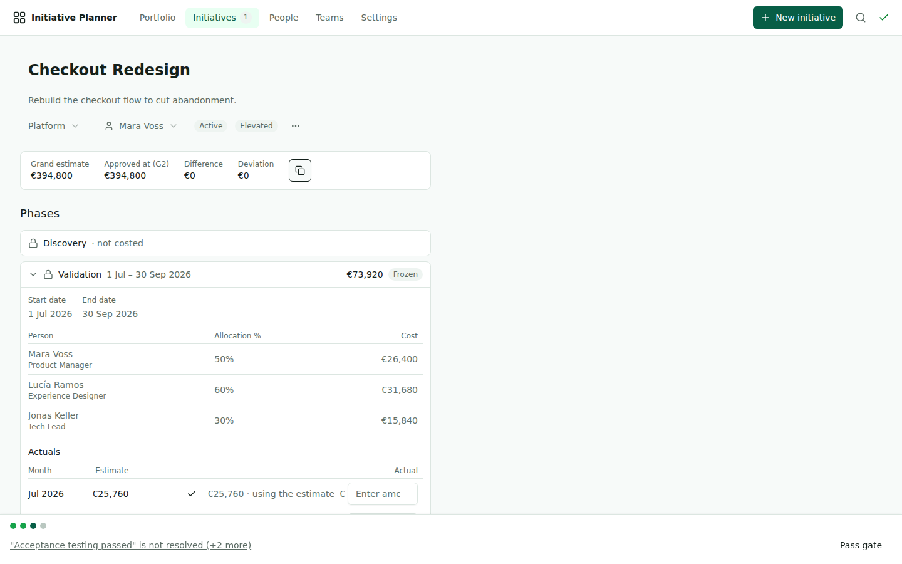 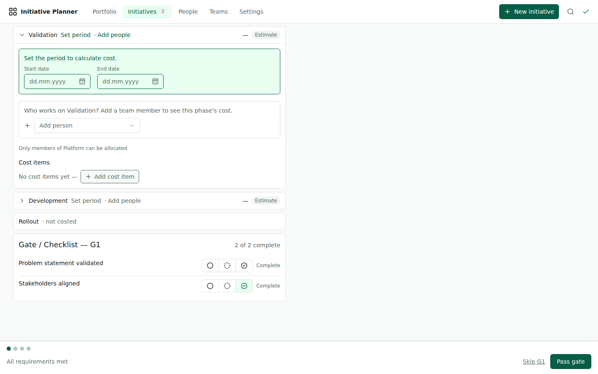 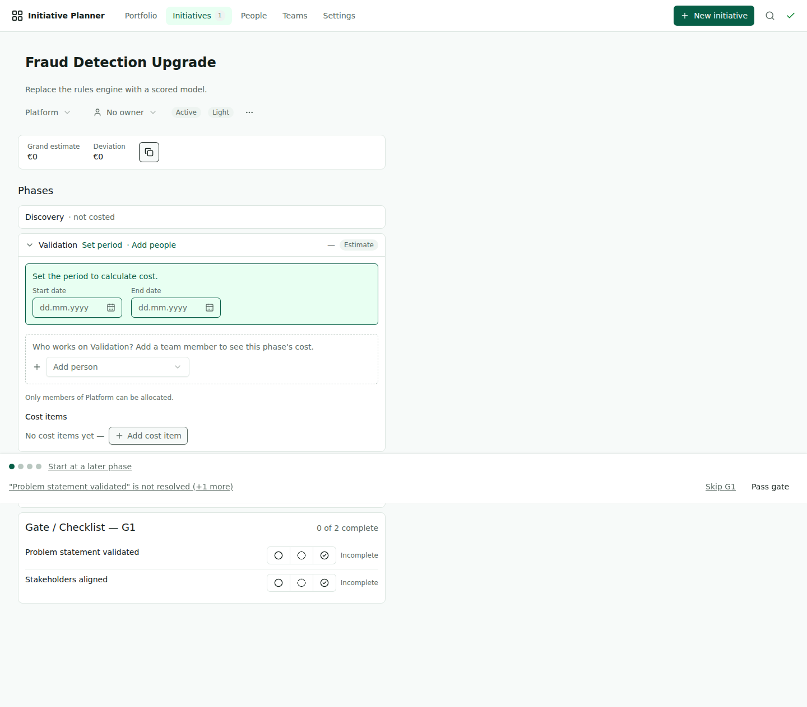

### F08 · P1 · Editable header fields don't look editable

*Initiative detail header · effort S*

- **What happens:** Name, description, team and owner are inline inputs with no border or fill at rest in light mode, so they look like static text. In dark mode they show filled boxes. The input padding also pushes the title 13px right of the cards below it.
- **Why it matters:** §5.4 makes inline editing the core way to work. Without a cue, people don't find it. Heuristic: recognition over recall. It also misaligns the page's left edge.
- **Recommendation:** Show a hover and focus state (subtle fill and border, pencil icon on hover) the same in both themes. Pull the title back by its padding (negative margin) so its text lines up with the cards.

 

### F09 · P1 · Long initiative names are clipped mid-word

*Initiative detail header · effort S*

- **What happens:** A long name is cut off at the edge of the 656px column in the 28px heading ("…deliberately long name" stops mid-letter). There is no ellipsis, wrap or tooltip. The board card does truncate with an ellipsis.
- **Why it matters:** Clipped text is unreadable, and this is the page's main identifier.
- **Recommendation:** Use an auto-growing textarea (field-sizing: content) that wraps to two lines for the title, as the description already does.

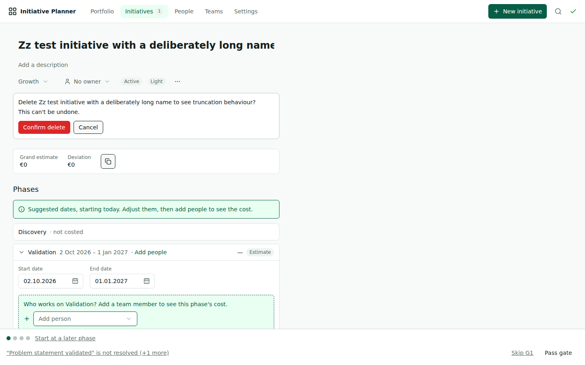 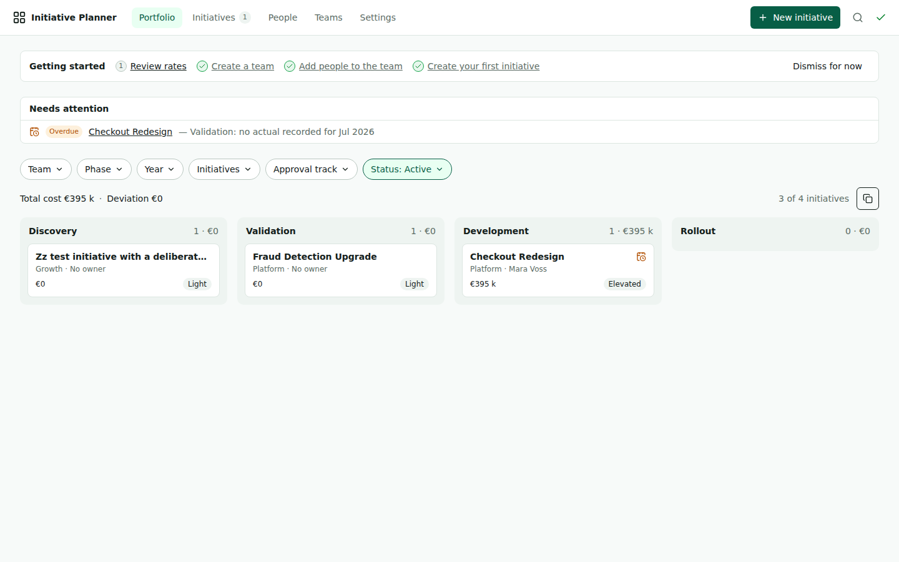

### F10 · P1 · Row actions are unlabelled icons with mixed meanings

*People · Team detail · Settings · effort S*

- **What happens:** The "user-x" icon means deactivate a person (People), remove a role (Settings › Roles), remove a country (Countries & rates), and something different from the trash icon next to it on Team members. None of them have visible text.
- **Why it matters:** The same icon means four things, and a person icon on a country makes no sense. Users have to hover to find out what a button does to their data. Heuristic: consistency, recognition over recall, error prevention. §9.10 icons.
- **Recommendation:** Put row actions in a "⋯" DropdownMenu with text labels ("Remove from team", "Deactivate person"). If one icon stays, use one icon per meaning (trash = delete, archive = deactivate, user-minus = remove from team) and add a tooltip.

 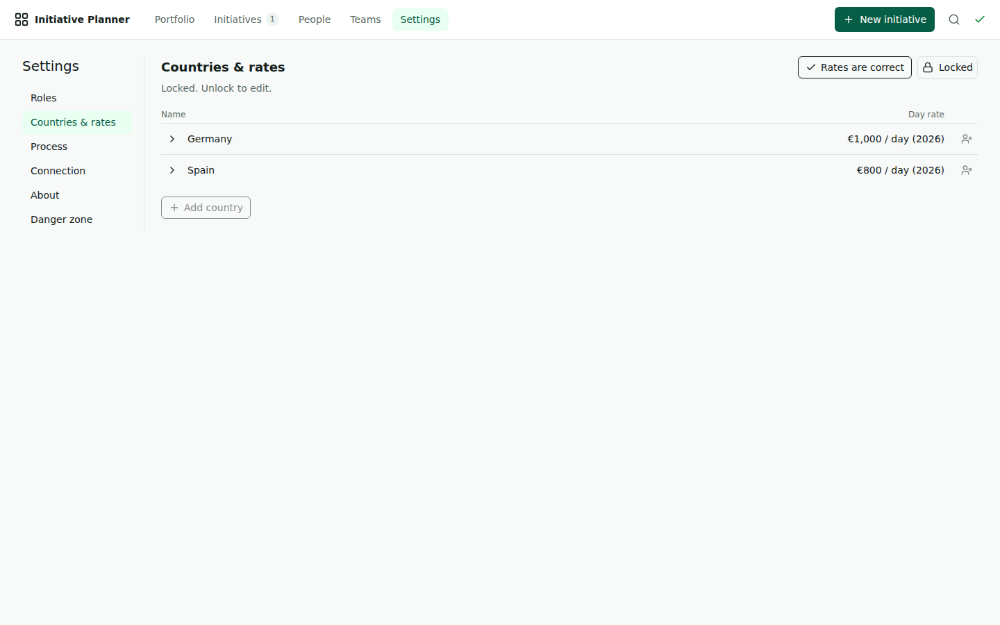 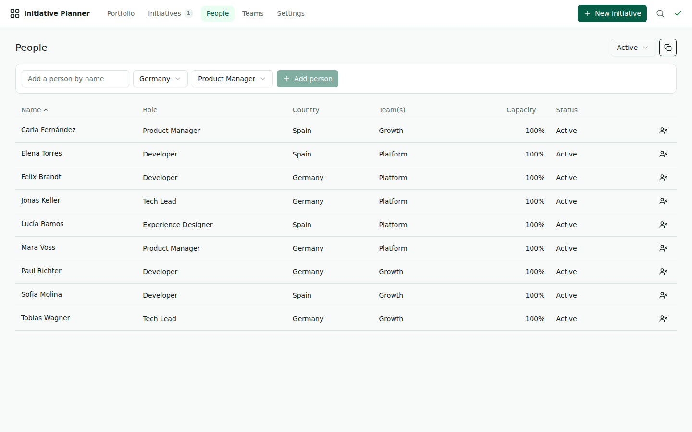

### F11 · P2 · Half the window is unused on the main working page

*Initiative detail · Team detail · effort L*

- **What happens:** At 1440px the initiative page is one 656px column and the right half is empty. Team detail uses a 768px column for Members and Initiatives, then full width for Capacity.
- **Why it matters:** On a desktop-first tool (§9.8) the most-used page shows the least. Users scroll a lot to get from the cost summary to the gate panel. Inconsistent widths make the page feel unplanned.
- **Recommendation:** Use a shared page container (max about 1280px). On the detail page, at ≥1280px use two columns: phases on the left, and a sticky right rail with the cost summary and the current gate's checklist. Below 1280px keep one column. Pick one width per page.

 

### F12 · P2 · Headings and base type don't follow one scale

*All screens · effort M*

- **What happens:** Overview headings (Initiatives, People, Teams) are 22px regular. The initiative heading is 28px bold. Settings section headings are bold in Roles, Countries and Danger zone but regular in Process and Connection. Body text is 14px and table rows are about 37px.
- **Why it matters:** §9.8 sets 15px base text, 40px table rows, and two weights in a fixed scale. Mixed headings weaken the hierarchy and make screens feel built at different times.
- **Recommendation:** Define type tokens (display, title, section, body-15, small-13, caption-12) in @theme and a <PageHeader> / <SectionHeader> pair used by every screen. Set the body to 15px and table rows to h-10.

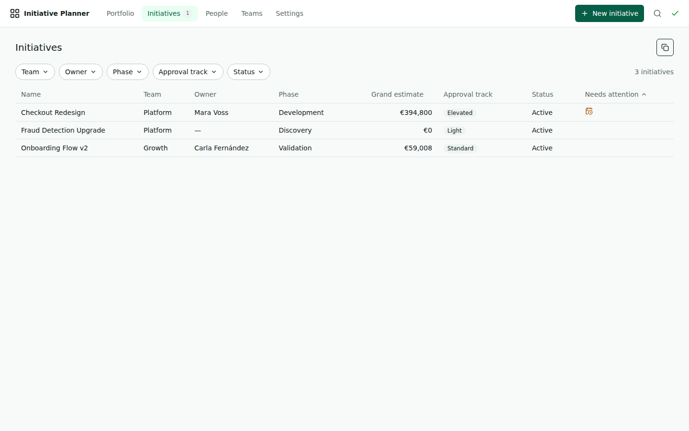  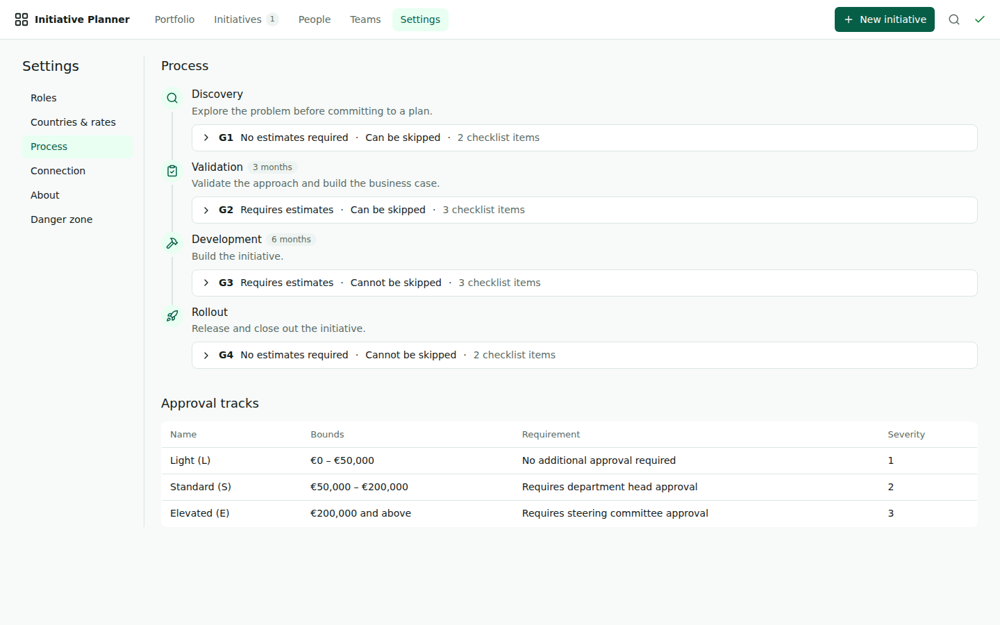

### F13 · P2 · The Copy button moves around and has no label

*Portfolio · Initiatives · People · Teams · Detail · effort S*

- **What happens:** Copy is an icon-only bordered button in a different place on each screen: beside the count (Portfolio), top right (Initiatives), next to the Active filter (People), left of New team (Teams), and inside the cost summary card (Detail).
- **Why it matters:** Users can't build a habit, and the dark border makes a secondary action look heavier than New team. Heuristic: consistency.
- **Recommendation:** Put it in the same spot on every screen (right end of the toolbar row, after the count). Make it a ghost button with a label ("Copy table") or a tooltip, with a toast that says what was copied (that part already works).

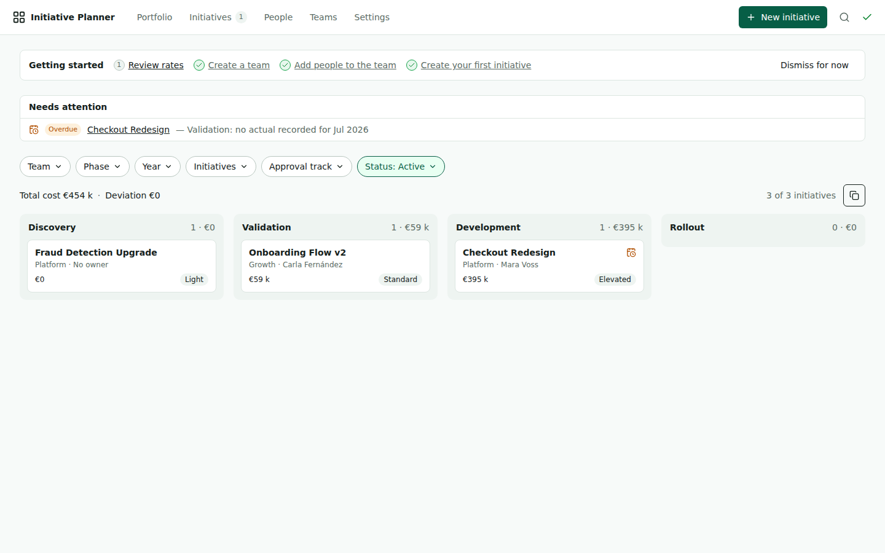   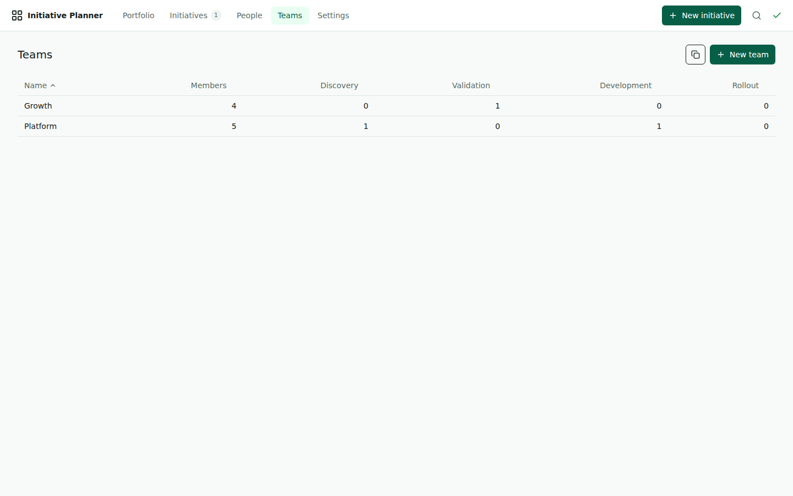

### F14 · P2 · Numbers and dates appear in several formats

*All screens · effort S*

- **What happens:** The same cost reads "€395 k" (board), "€394,800" (table, detail) and "€454 k" (total, with a space before k). Date fields show "01.10.2026" while all text shows "1 Oct 2026".
- **Why it matters:** §9.7 language and formats. Mixed formats slow down comparing figures and look unfinished.
- **Recommendation:** Keep compact amounts for the board (fine), but write them the same way ("€395k", or a thin space everywhere). Display date fields in the same "1 Oct 2026" format, or use the shadcn date picker with a formatted trigger.

 

### F15 · P2 · The actuals row is crowded and its placeholder is cut off

*Initiative detail · Actuals · effort S*

- **What happens:** Each closed month shows "✓  €25,760 · using the estimate  €  [Enter amo]". The placeholder is cut off, the € sits apart from its field, and the check icon's meaning (record the estimate as the actual) is only in a tooltip.
- **Why it matters:** §5.4 actuals. Recording actuals is a monthly task, so it should be quick and clear.
- **Recommendation:** Use an InputGroup with € inside the field and the placeholder "Actual". Make the one-click action a text button "Use estimate". Show the estimate once, in its own column.

 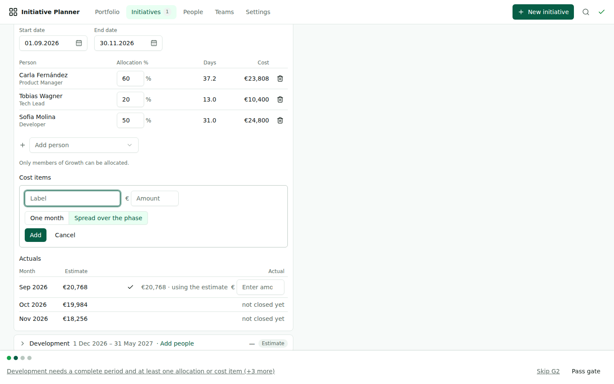

### F16 · P2 · "Getting started" stays up and its last step is hard to find

*Portfolio · effort S*

- **What happens:** With 3 of 4 steps done the strip stays at the top. Step 1 "Review rates" only completes from a "Rates are correct" button in Settings › Countries & rates, which the link takes you to without pointing it out. There is no progress count.
- **Why it matters:** It takes 50px of the landing page for a long time. Users won't know what counts as reviewing rates.
- **Recommendation:** Show "3 of 4 done". Highlight the "Rates are correct" button when arriving from the strip. Let the strip collapse to a chip once three steps are done.

 

### F17 · P2 · First run shows three "Create a team" buttons and little explanation

*Portfolio (first run) · effort S*

- **What happens:** A fresh install shows "Create a team" in the top bar, in step 2 of Getting started, and in the empty state, which itself just says "No initiatives yet / No teams yet."
- **Why it matters:** This is the first screen anyone sees. Three identical calls to action compete with each other, and nothing explains what the board will show. §9.4 empty states.
- **Recommendation:** Keep one primary action in the empty state, with a short sentence ("Initiatives move through Discovery → Rollout here. Start by creating the team that does the work."). Remove the duplicate from the top bar until a team exists.

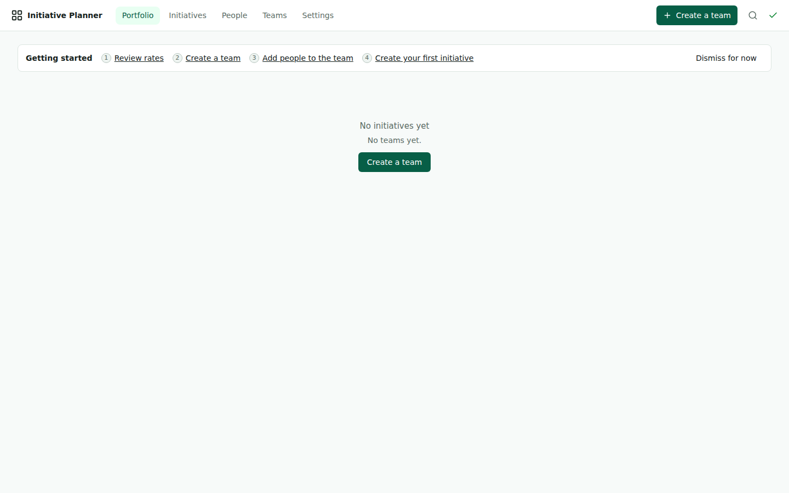

### F18 · P2 · Sync status and the nav badge aren't explained

*Top bar · effort S*

- **What happens:** When everything is saved, sync status is a lone green check at the top right. The "1" badge on Initiatives counts initiatives that need attention, but only its aria-label says so. It went to 2 when a gate became ready.
- **Why it matters:** Users can't tell whether their work is saved. Heuristic: visibility of system status (§3 sync behaviour).
- **Recommendation:** Show "Saved" next to the check (or on hover), and "Saving…" or "2 unsaved" while writes are in progress. Give the badge a tooltip ("1 needs attention") and use the warning tint when it counts problems.

### F19 · P2 · Status and approval track look the same

*Initiative header · Board · Tables · effort S*

- **What happens:** Status (Active / On Hold) and approval track (Light / Standard / Elevated) use the same grey pill. The capitalisation also varies: "On Hold" in the header and "On hold" in the bar.
- **Why it matters:** These are different kinds of information. Elevated (steering committee) is easy to miss. §9.2 copy.
- **Recommendation:** Use a shadcn Badge with variants: status as a dot and text, track as an outline badge with its letter (E, S, L). Use sentence case everywhere.

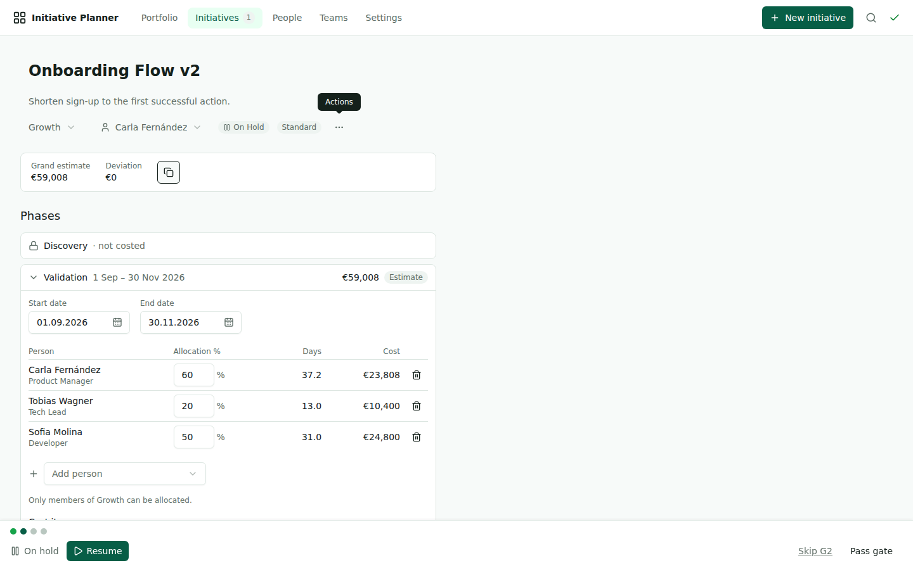 

### F20 · P2 · Team colours aren't part of the brand palette

*People · Person panel · effort M*

- **What happens:** Team colours are hard-coded Tailwind violet, teal, amber, rose, sky and lime (teamColors.ts). In the person panel a bright violet capacity bar sits next to the green brand.
- **Why it matters:** §9.8: colour carries meaning and comes from the brand pack. A fork can't re-theme these, and they aren't contrast-checked at build like the other tokens.
- **Recommendation:** Move a categorical palette into the brand pack (team-1 … team-6, light and dark), validated with the existing contrast check, or show team identity with the team name only.

### F21 · P2 · The person panel opens with the name selected

*Person panel · effort S*

- **What happens:** Opening a person focuses the Name field with all its text selected. A stray key press replaces the name.
- **Why it matters:** Error prevention. Most visits are to change capacity or teams, not to rename.
- **Recommendation:** Move focus to the panel heading, or the close button, without selecting anything. §9.5 already defines Esc, which returns focus to the row.

### F22 · P2 · The Tentative note field has no label, and a tooltip covers the count

*Gate checklist · effort S*

- **What happens:** Choosing Tentative opens a blank field with Save and Cancel, but no label or placeholder. The toggle's tooltip covers the "1 of 2 complete" count above it.
- **Why it matters:** §5.4 Tentative note. Users don't know what to write. WCAG 3.3.2 Labels or Instructions.
- **Recommendation:** Label it "Why tentative?" with an example placeholder. Show the toggle tooltips below the toggles.

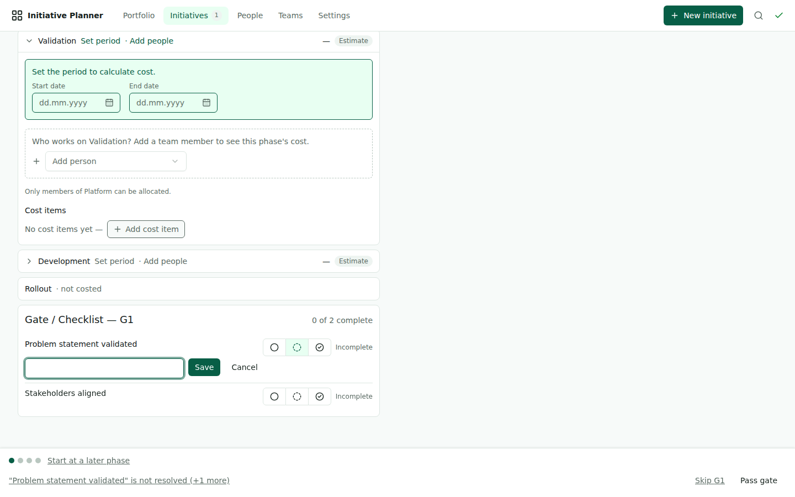 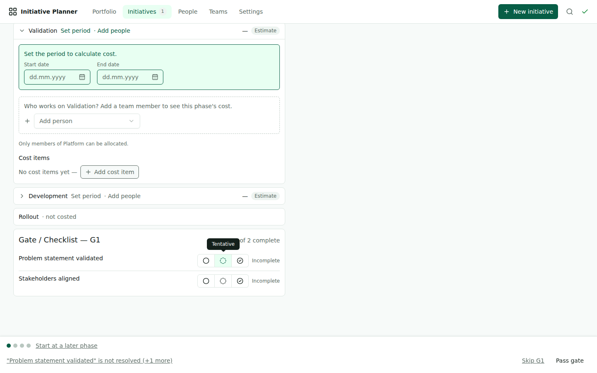

### F23 · P2 · Page structure for screen readers

*All screens · effort S*

- **What happens:** axe (WCAG 2.2 AA plus best practices) found no serious or critical violations. On every screen it reports no <main> landmark and content outside landmarks. Portfolio has no h1.
- **Why it matters:** Screen-reader users jump by landmark and heading. §9.5.
- **Recommendation:** Wrap routed content in <main>, give the magic bar role="region" with a label, and add a visually hidden h1 "Portfolio". Add the `region` and `landmark-one-main` rules to the e2e a11y scan.

### F24 · P2 · Table cells don't line up

*People · Teams · effort S*

- **What happens:** On People, the Name cell (a button) sits about 2px higher than the rest of the row. On Teams, the column headers are left-aligned while the numbers under them are right-aligned, so headers float away from their values.
- **Why it matters:** Uneven alignment is the most common sign of an unpolished table.
- **Recommendation:** Align the cell contents vertically, and right-align numeric headers with their columns (a shared <Th numeric> prop).

 

### F25 · P2 · The new-initiative placeholder looks like a real name

*New initiative · effort S*

- **What happens:** The empty name field shows "Name this initiative" in the 28px bold heading style, in dark grey, so it reads as content. The rest of the page is blank.
- **Why it matters:** Users may think it has already been named. The blank page doesn't preview what comes next.
- **Recommendation:** Use the muted text colour for the placeholder. Under the field, show greyed previews of the cost summary and phases, so creating feels like filling in the page users already know.

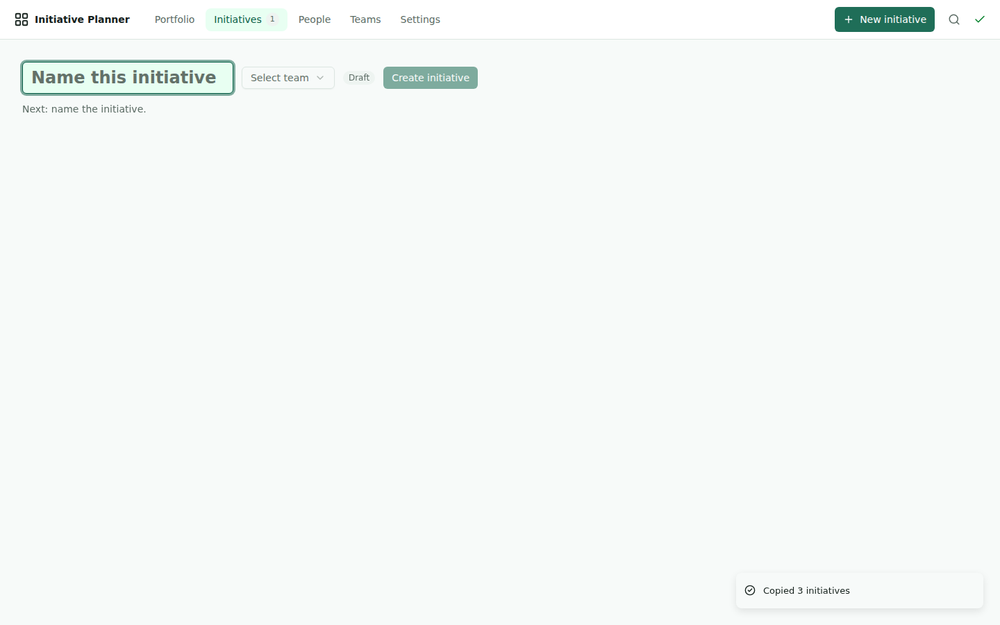

### F26 · P2 · Connect screen: misaligned checkbox and an error with no next step

*Connect · effort S*

- **What happens:** The "Remember me" checkbox sits about 4px below its label's baseline. A rejected token shows "GitHub doesn't accept this token." with no icon and no likely cause.
- **Why it matters:** This is the first impression. Errors should say what to do next.
- **Recommendation:** Use the shadcn Checkbox and Label. Write the error as: "GitHub didn't accept this token. It may have expired or be missing Contents: Read and write. Create a new one ↓". Consider adding the brand pack logo.

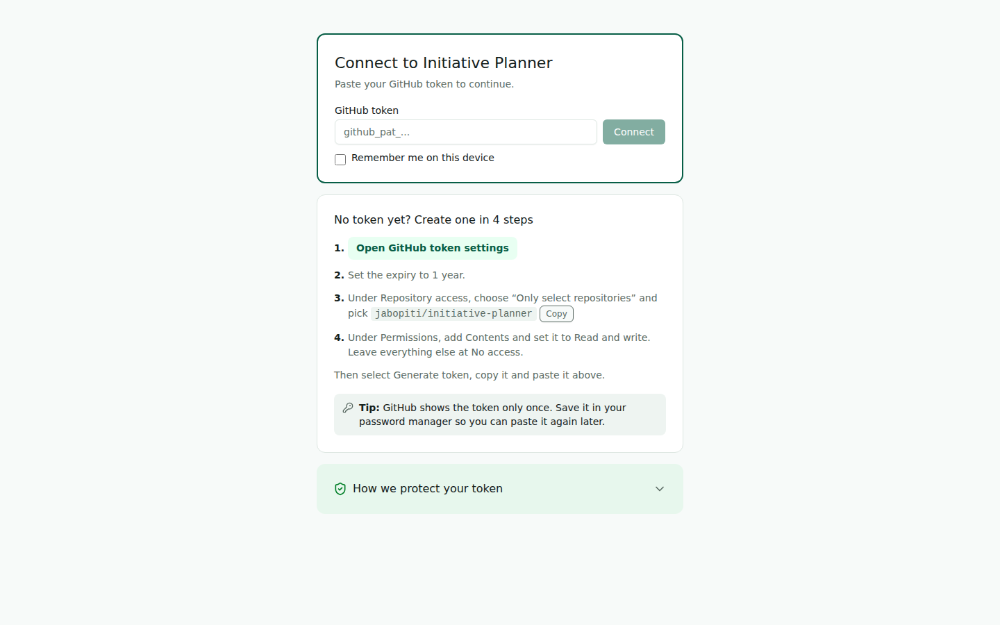 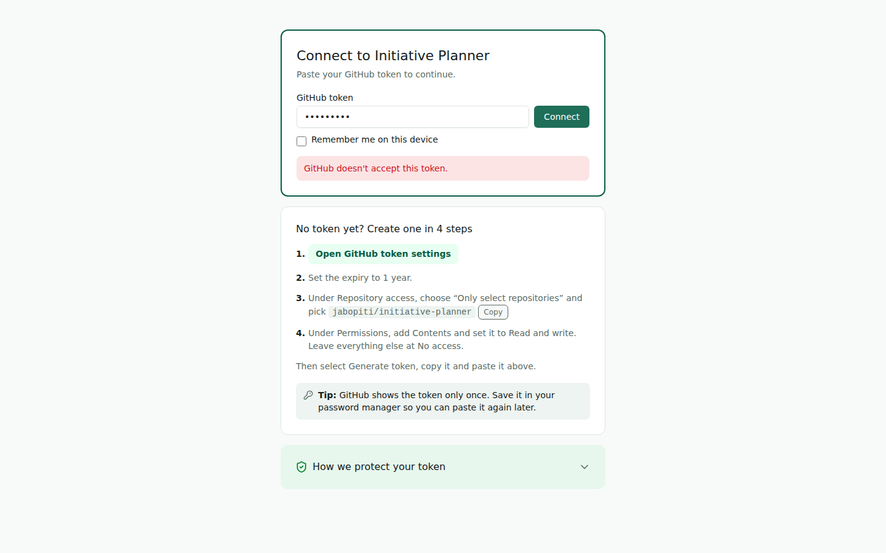

### F27 · P3 · An empty board column shows no placeholder

*Portfolio · effort S*

- **What happens:** The Rollout column is only a header with "0 · €0".
- **Why it matters:** An empty column with a short placeholder reads as intentional.
- **Recommendation:** Add a dashed placeholder: "No initiatives in Rollout".

### F28 · P3 · Filter options aren't sorted

*Filters · effort S*

- **What happens:** The Team filter lists Platform before Growth.
- **Why it matters:** §9.11 lists. Options are easier to find in alphabetical order.
- **Recommendation:** Sort filter options alphabetically, keeping the selected ones first.

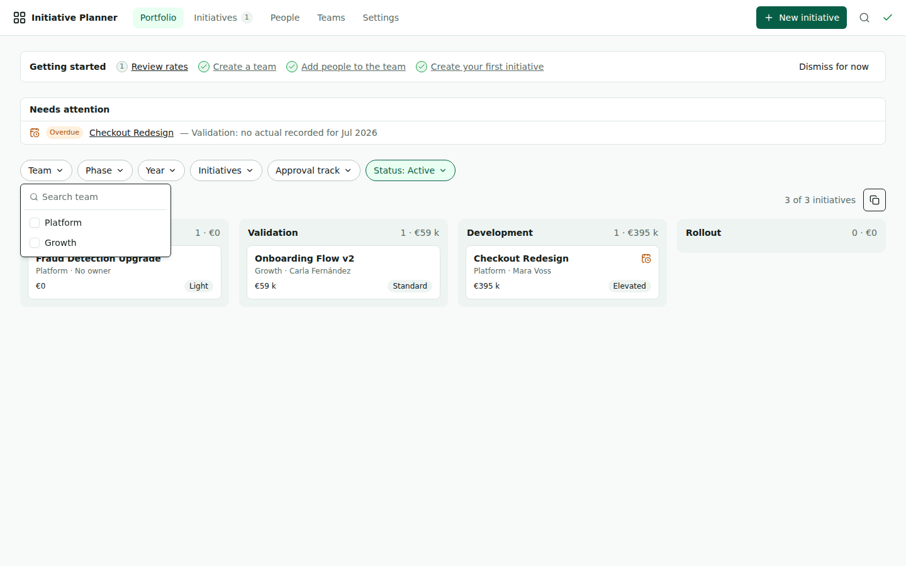

### F29 · P3 · "Cancel" in the Actions menu is ambiguous

*Actions menu · effort S*

- **What happens:** The menu offers "Cancel" next to Put on hold and Duplicate.
- **Why it matters:** "Cancel" usually means close this menu.
- **Recommendation:** Rename to "Cancel initiative…". Leave a separator before the destructive items.

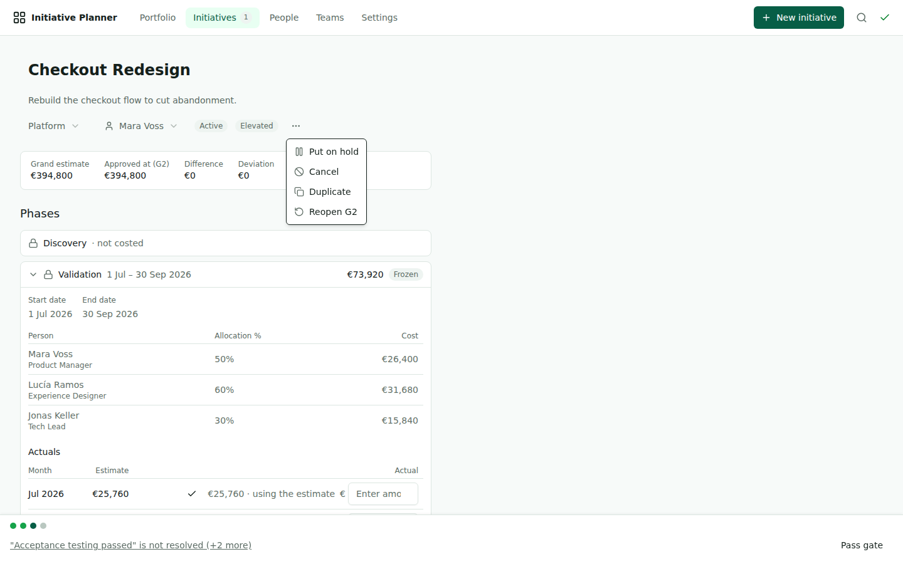

### F30 · P3 · Locked settings look disabled, and the lock button shows a state

*Settings · effort S*

- **What happens:** Locked fields are greyed like disabled inputs. The toggle reads "Locked", which is a state, not an action.
- **Why it matters:** Users can't tell whether clicking will lock or unlock.
- **Recommendation:** Show the values as plain text while locked, and label the button "Unlock to edit" / "Lock".

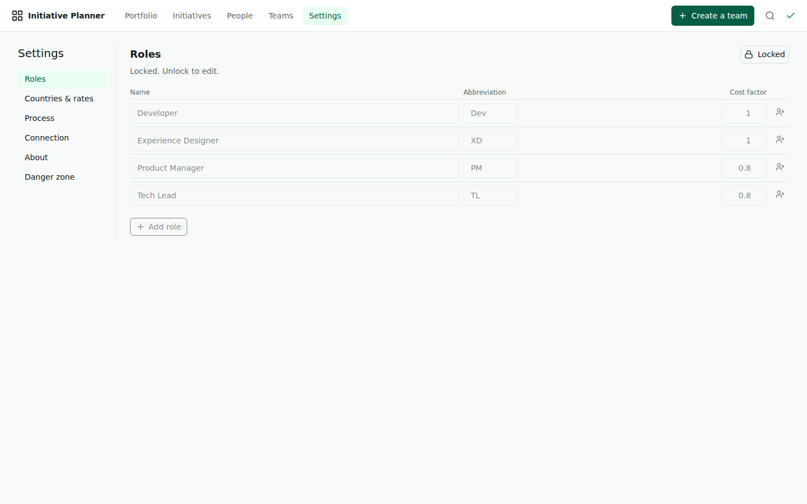 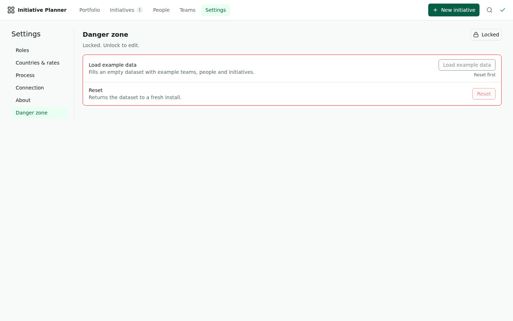

### F31 · P3 · The "Actions" tooltip stays open after the menu closes

*Initiative detail · effort S*

- **What happens:** After choosing a menu item, focus returns to "⋯" and its tooltip stays visible.
- **Why it matters:** It is visual noise left over from finishing a task.
- **Recommendation:** Don't open the tooltip when focus is returned programmatically (Radix `onCloseAutoFocus`).

## Making it look and feel more modern

- **Type with character and a strict scale.** Replace system-ui with a brand-pack variable face that has true tabular figures (e.g. IBM Plex Sans, Source Sans 3 or Geist). Set 15px body text (§9.8) and six type tokens. Use the display weight only for the initiative name and page titles. This changes how the app looks more than anything else on this list.
- **A page shell and a detail page that uses the width.** Use one container (about 1280px), 32px gutters, a shared PageHeader (title, count, actions on the right) and a shared toolbar row (filters left, count and Copy right). On the detail page, use two columns at ≥1280px: phases on the left, and a sticky right rail with the cost summary, the current gate checklist and the next action. The magic bar can then be a slim bar aligned to the content.
- **Show the process visually.** Swap the four dots for a labelled stepper. Add a thin phase timeline (Gantt-lite) to the initiative header and team capacity. Give the board column headers a small cost bar, so the total is something you can see. All of this is Tailwind HTML, no charting library (§10.1).
- **Fewer boxes, clearer layers.** Today almost every block has a 1px border and a radius. Keep cards for things that are objects (initiative cards, the phase accordion). Show sections with spacing and a heading instead of a box. Use shadows only for floating layers (popovers, sheets, toasts). Make the page background a little cooler and the cards white, so cards stand out without borders.
- **Use more of shadcn/ui.** Badge variants for status and approval track. Tooltip on every icon button. DropdownMenu for row actions. InputGroup for €, % and "days" suffixes. A labelled ToggleGroup for checklist status (Open, Tentative, Done). Sheet for the person panel (already close). Skeleton while loading. An EmptyState component (icon, sentence, one action). A Calendar popover for dates with a formatted trigger.
- **Ship the theme, and test both.** Add the System / Light / Dark control (F04), give team colours brand-pack tokens (F20), and use one focus ring (F03). Run the axe e2e pass in both themes and add visual snapshots of each screen per theme, so a regression in one theme shows up.
- **Small motion for feedback.** Add 120–180ms transitions on the accordion, the toast, the rail and the "Passed — Reopen" moment, plus a brief tint when a figure recalculates. Turn them all off under prefers-reduced-motion (already in §9.5).
- **An icon vocabulary.** Write a short table in §9.10, one meaning per Lucide icon (trash = delete, archive = deactivate, user-minus = remove from team, copy, lock), and check it in review. That fixes F10 and keeps it fixed.

## Keep these

- **Guided empty phases.** A phase with no plan shows a tinted "Set the period to calculate cost" box and "Who works on Validation?", which is a good model for every other empty state.
- **Pass gate becomes the main action when ready.** Blocked, it jumps to the first open item and focuses it. Once ready it turns into the primary button, and afterwards the bar shows "Passed G1 — Reopen".
- **Failures are honest and recoverable.** Offline, the app shows a read-only banner, a status in the top bar, and a "Not saved … Retry" next to the exact field.
- **Destructive actions are confirmed inline.** Delete names the initiative, says it can't be undone, and needs one more click, with no modal.
- **Good error copy.** "Enter a percentage from 0 to 100." says what to do, in plain words.
- **Clear Connect walkthrough.** Four numbered steps, a repo name with a Copy button, and a security explainer.
- **Process settings read like a process.** A vertical stepper with phase icons and gate summaries is the clearest visual on any screen.
- **Clean on the strict rules.** axe found no serious or critical WCAG A/AA violations, and state always has a text cue.

## Suggested slices

- **Quick fixes (one slice, about 1–2 days):** F01, F02, F03, F09, F10, F13, F21, F22, F23, F24, F28, F29, F31
- **Detail page (one slice):** F05, F06, F07, F08, F15
- **Theme and tokens (one slice):** F04, F12, F14, F19, F20, plus the type and colour parts of the visual design recommendations
- **Layout update (one or two slices, mockups first per AGENTS.md):** F11, F16, F17, F25, F26, F27, F30, plus the page shell, the process visuals and the fewer-boxes approach above
